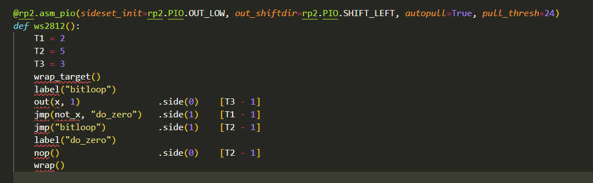
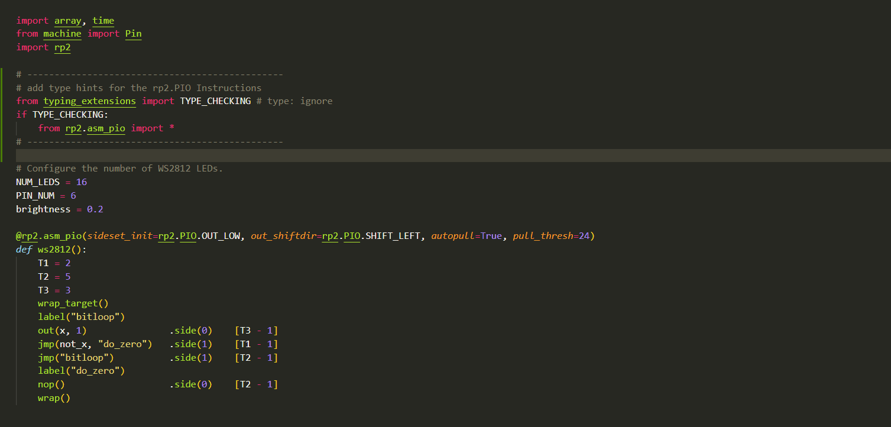

# Proof of concept of type hints for the Micropython RP2 PIO assembler 

This is a PoC for adding type hints for the PIO assembler. It is not a full implementation, but it shows the idea.

the goal is to allow have the simular benefits in code PIO code , as there is for MicroPython code.

| Regular | With pio_asm_types |
| -------- | -------- |
|  |  |


I have not found a way to automatically load the type hints when the `@rp2.asm_pio` decorator is used. So the type hints have to be loaded manually.
to to this add the following lines to the top of the file with the PIO assembler code:

```python
# -----------------------------------------------
# add type hints for the rp2.PIO Instructions
from typing_extensions import TYPE_CHECKING # type: ignore
if TYPE_CHECKING:
    from rp2.asm_pio import *
# -----------------------------------------------
```

To allow both typechecking and running the code on the RP2, then you will also need th add an additional file `typing_extensions.py` to your scripts  or lib with the following content:

```python
# typing_extensions.py
TYPE_CHECKING = False
```

This allows the typechecking to run without errors, but the `if TYPE_CHECKING:` block will not be executed when the code is run on the RP2.

For the current implementation see the [`typings/rp2/rp2.pyi`](typings/rp2/rp2.pyi) file. 

# Open items 

 - [ ] Does the manner and name for importing the type hints make sense?

 - [ ] Is there a way in which the type hints can be loaded automatically by type-checkers such as pylance and mypy?
 - [ ] The decorator has limited type information, to improve this it may be needed to depend on Pyton 3.10 or later to allow for a better support for type hints
 - [ ] The type hints are not complete, also some of the methods currently need to be duplicated to allow for the fluent style of programming. e.g. `out().side(0)`
 - [ ] The text for the docstrings originates from multiple locations, and is not always consistent.
        - Micropython RP2 Documentation - not fully complete on all methods and classes
        - RP2 python and C datasheets - sometime the language does not make sense in a python context.
- [ ] The defined methods and functions are also avaiable to the type checkers after/outside the scope where the `@rp2.asm_pio` decorator is used, this is not needed and should be removed.
This can/will be confusing when the same names are used in the PIO assembler code and in the python code.

 - [ ] The type hints should be included with the `micropython-rp2[-*]-stub` packages, for this the generation of the stubs is preferred to be mostly automated.

Please feel free to comment and suggest improvements.
